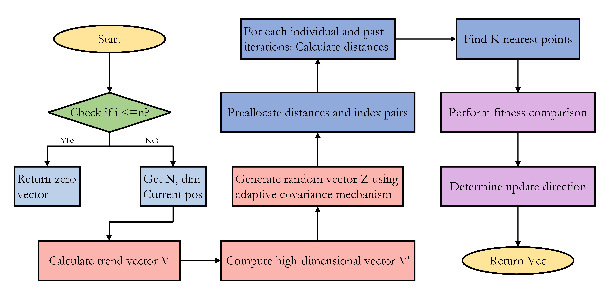

# Trend-Aware Mechanism: An Novel Update Strategy for Improved Metaheuristic Algorithm Performance

**Authors:**  
Junbo Jacob Lian, Kaichen OuYang, Rui Zhong, Yujun Zhang, Shipeng Luo, Ling Ma, Xincan Wu, Huiling Chen  

**Abstract:**  
In metaheuristic optimization algorithm design, historical search position information is often underutilized, despite its potential to reveal both individual movement trends and promising search directions. To address this, we propose a Trend-Aware Mechanism (TAM) that leverages historical search position data to enhance the updating of individual positions. TAM first determines the primary movement direction by calculating a trend line between population positions from the previous two iterations. It then evaluates whether a more optimal search position exists between these points by analyzing the fitness of the K points closest to the trend line. An adaptive covariance mechanism is subsequently employed to generate high-dimensional random vectors that balance historical trends with random exploration, allowing for dynamic adjustment of position updating strategies. Experimental results demonstrate that TAM significantly enhances population search capabilities and yields superior optimization performance across a range of standard benchmark functions.

**Keywords:**  
Trend-Aware Mechanism, Metaheuristic, Optimization Algorithm, Update Strategy, Evolutionary Computation

## Installation

To use the Trend-Aware Mechanism (TAM) algorithm, simply clone this repository:

```bash
git clone https://github.com/junbolian/Trend-Aware-Mechanism.git
```

Then, navigate into the directory and follow the instructions in the usage section below.

## Usage

TAM can be integrated with your existing metaheuristic algorithms. Here is an example of how to use TAM with a basic population optimization loop:

1. Define the `search_history` and `fitness_history` arrays that store the positions and fitness of individuals over iterations.
2. Call the `TrendAwareMechanism()` function to update positions using historical data and trend-aware updates.
3. Integrate the updated positions into your optimization loop.

For details on the function and algorithm implementation, refer to the code in this repository.

## Algorithm: Trend-Aware Mechanism (TAM)

```python
# Pseudo-code for TAM algorithm
1: INPUT: search_history, fitness_history, Max_iter, i, j, K
2: IF i <= n THEN
3:      RETURN zero vector of size 1 × dim
4:  END IF
...
```

Refer to the [Algorithm](#) section in the paper for more details.

## Key Features
- **Historical Trend Utilization:** Uses past search positions to predict movement trends and optimize future positions.
- **Adaptive Covariance Mechanism:** Balances exploration and exploitation during position updates.
- **Integration with Popular Algorithms:** Tested with PSO, SHADE, JaDE, and CMA-ES for enhanced optimization performance.

## Experimental Results

TAM was tested on a variety of benchmark functions and showed significant improvements over existing optimization algorithms. Detailed experimental results are available in the accompanying paper.

## Citation

If you use this algorithm in your work, please cite the following paper:

J. J. Lian et al., Trend-Aware Mechanism for Metaheuristic Algorithms. 


## Flowchart

A flowchart summarizing the Trend-Aware Mechanism can be found below:



